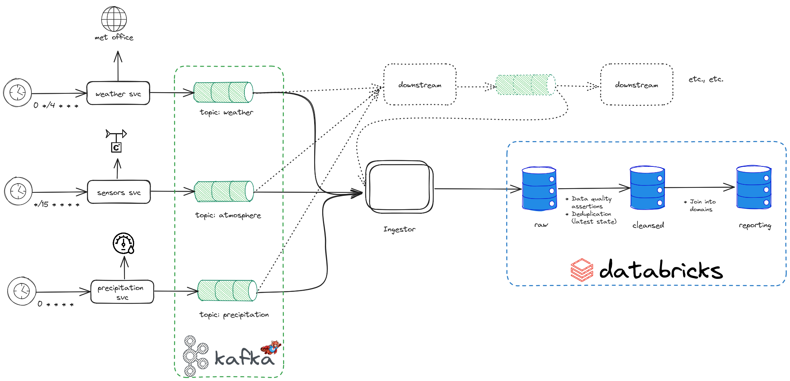

# RP Consumer

Consume from an arbitrary set of topics and write somewhere for databricks to do stuff with.

## Rationale

This project forms the basis of a techtest (the company name is with-held so nobody finds this solution when searching github for them ahead of tech tests).

It exists to provide some dummy data into a datalake for Databricks to pick up; effectively it provides everything to the left of (and including) the ingestor in the following diagram

This architecture describes the analytics subsystem of an Environment Control System. It contains three types of data, and three stages (following a bastardised version of the [medallion data architecture](https://www.databricks.com/glossary/medallion-architecture)):

1. Weather Forecasts - these contain a temperature which _may_ be anything, but realistically is between a range; this is data that we should warn on when a non-conforming value is found. They also contain two timestamps- `forcasted_for` and `forecasted_on` - we can reject forecasts for too far in the past (based on `forecasted_on`)
2. Sensors - these contain humidty; a value with a specific range, where a non-conforming value is effectively a stop the world
3. Precipitation - these contain a precipitation reading, which is a counter. This type requires a more complex contextual quality assertion, rather than the naive row level assertions our other types use.

The three stages are:

1. Raw data- this is the data we pick directly off the wire. Data is primary-keyed on the message ID from kafka (which requires thought around log compaction strategies), which means _all_ data is available- even where a producer needs to reprocess messages. This data has a 1-to-1 mapping of kafka topic to table and provides:
   1. Some form of debuggability, which is an important (though often overlooked) form of analytics data; and
   2. Allows us to reprocess/ re-run pipelines without needing to reingest
2. Clean data- this data has had quality assertions, validations, and basic transformations run against it and is keyed in such a way that it contains latest state. This provides a layer best for Business Intelligence; data is clean _enough_ for analysts to combine with their own datasets to provide, effectively, time-series data that broad trends can be identified for commerical use. This data is still effectively a 1-to-1 mapping of topic to table, but allows multiple raw tables to be combined where a raw table's schema diverges so far that changes to it will cause older data to bork.
3. Reporting data- this is the 'Gold' data in medallion parlance; this data is combined away from the topic->table mapping into domain tables and provides Management Information (MI) reporting.

### On mint messages

This project uses [mint messages](https://github.com/vinyl-linux/mint) under the hood to [shift left](https://devops.com/data-reliability-needs-to-shift-left/) data quality, by providing message/row level validation capabilities for developers and data owners.

The benefit of this is reasonably clear: where a produce produces a message which is capital-i Incorrect, and thus is unsuitable for processing, but which downstream services can process then reporting no longer reflects reality- for MI reporting, where jobs and finances are won and lost based on data quality, this can be catastrophic.

This process uses mint to take the strain off the data team and put it squarely back on the product team.
